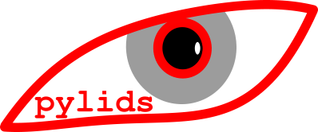
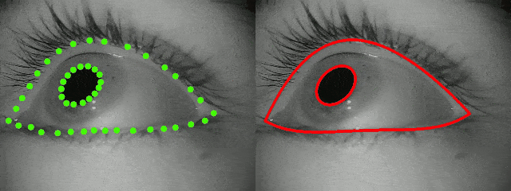

  

# Pylids
A suite of tools for robust and generalizable estimation of eye shape from videos.

With pylids you can use a pretrained DNN model based on [DLC](https://github.com/DeepLabCut/DeepLabCut) to:

* Estimate the pupil outline 
* Estimate the shape of the eylids

pylids also provides users with tools to finetune the default DNN model to ensure generalization on their dataset. 
Users can:

* Automatically generate optimally selected domain specific data augmentations to improve pupil and eyelid estimation on new datasets
* Select miniminum frames to relabel from the new dataset to ensure generalization

pylids has been built to be used with the pupil lab gaze estimation pipeline.

### How to install pylids

Use the shell script `pylids_setup.sh`
Tested with CUDA version 10.2

### Demos

Check out the notebooks in the demo folder to see how to use pylids and train new models.

### Funding
The creation of pylids was funded by NSF EPSCoR \# 1920896 to Michelle R. Greene, Mark D. Lescorart, Paul MacNeilage, and Benjamin Balas.

### Citation
If you use pylids in your research, please cite the following paper:
    
Biswas, A., & Lescroart, M. D. (2023). A framework for generalizable neural networks for robust estimation of eyelids and pupils. Behavior Research Methods, 1-23.
https://link.springer.com/article/10.3758/s13428-023-02266-3
